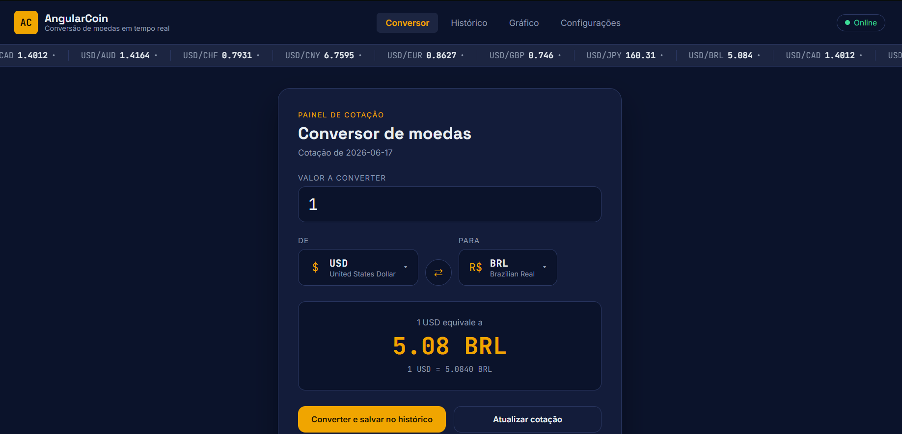
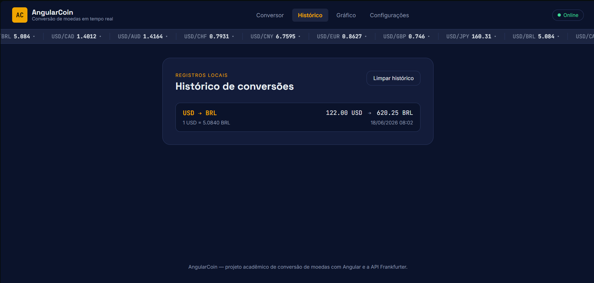
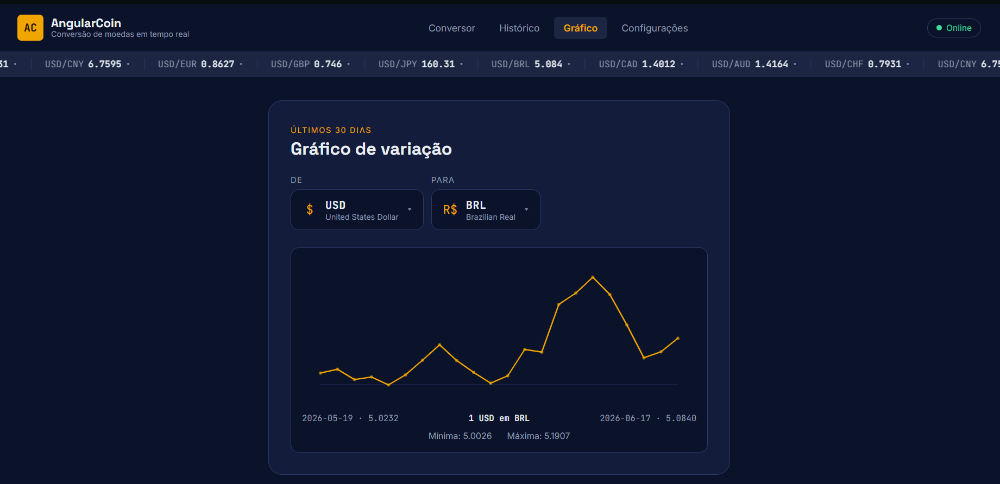

# 💰 AngularCoin

> Aplicativo web de conversão de moedas em tempo real, construído com **Angular** e **TypeScript**, consumindo uma API REST pública de cotações de câmbio.

AngularCoin permite consultar taxas de câmbio atualizadas, converter valores entre diferentes moedas do mundo, consultar o histórico de conversões já feitas (salvo localmente no navegador) e visualizar a variação da taxa de câmbio nos últimos 30 dias — tudo isso funcionando até mesmo offline, usando a última cotação salva.

---

## 📸 Capturas de tela

| Conversor | Histórico | Gráfico |
|---|---|---|
|  |  |  |

---

## ✨ Funcionalidades

- **Conversão de moedas em tempo real**, consumindo a API pública [Frankfurter](https://frankfurter.dev) (sem necessidade de chave de API).
- **Busca de moedas por nome ou código** (ex: digitar "real" ou "BRL").
- **Conversão inversa** com um clique, trocando origem e destino instantaneamente.
- **Histórico de conversões** salvo no `localStorage` do navegador, disponível em uma tela dedicada.
- **Modo offline**: se a API estiver inacessível, o app usa a última cotação salva localmente e avisa o usuário com um indicador "Modo offline".
- **Atualização automática das taxas**, com frequência configurável pelo usuário (15 min, 30 min, 1h, 6h ou 1x por dia).
- **Notificações de variação de taxa**, usando a API de Notificações do navegador, com limite de variação (%) configurável.
- **Gráfico dos últimos 30 dias** de variação da cotação entre duas moedas, usando dados históricos reais da API.
- **Faixa de cotações estilo painel de câmbio** rolando no topo da tela, com indicador de alta/baixa.
- **Interface responsiva**, adaptada para celular, tablet e desktop.

## 🛠️ Tecnologias

- [Angular](https://angular.dev) 18 (componentes *standalone*)
- TypeScript
- RxJS
- [Frankfurter API](https://frankfurter.dev) — API REST pública e gratuita de cotações de câmbio, com dados do Banco Central Europeu e outros bancos centrais
- `localStorage` do navegador para histórico e cache offline

## 🚀 Como executar localmente

```bash
# 1. Clone o repositório
git clone https://github.com/Vitoria-ws/AngularCoin.git
cd AngularCoin

# 2. Instale as dependências
npm install

# 3. Rode o servidor de desenvolvimento
npm start
```

Depois disso, acesse `http://localhost:4200` no navegador.

## 📁 Estrutura do projeto

```
src/app/
├── components/
│   ├── conversor/         # Tela principal de conversão
│   ├── historico/         # Tela de histórico de conversões
│   ├── grafico/           # Tela de gráfico de variação (últimos 30 dias)
│   ├── configuracoes/     # Tela de preferências do usuário
│   ├── currency-picker/   # Componente reutilizável de seleção de moeda (com busca)
│   └── ticker/            # Faixa de cotações no topo da tela
├── services/
│   ├── currency.service.ts     # Comunicação com a API e cache offline
│   ├── history.service.ts      # Histórico de conversões (localStorage)
│   ├── settings.service.ts     # Preferências do usuário (localStorage)
│   ├── selected-pair.service.ts
│   └── notification.service.ts
├── models/
│   └── currency.model.ts  # Interfaces TypeScript usadas no projeto
└── data/
    └── currency-symbols.ts
```

## 🌐 Sobre a API utilizada

Este projeto consome a [Frankfurter API](https://frankfurter.dev), uma API REST pública, gratuita e sem necessidade de cadastro ou chave de acesso, que fornece cotações de câmbio (atuais e históricas) com base em dados de bancos centrais.

Principais endpoints utilizados:

| Endpoint | Uso no projeto |
|---|---|
| `GET /v1/currencies` | Lista de moedas disponíveis (código + nome) |
| `GET /v1/latest?base=USD` | Cotações mais recentes a partir de uma moeda base |
| `GET /v1/{data-inicial}..{data-final}?base=USD&symbols=BRL` | Série histórica usada no gráfico |

## 📄 Licença

Este projeto está licenciado sob a licença MIT — veja o arquivo [LICENSE](LICENSE) para mais detalhes.

---

Projeto acadêmico desenvolvido como atividade complementar de Angular e consumo de APIs REST.
